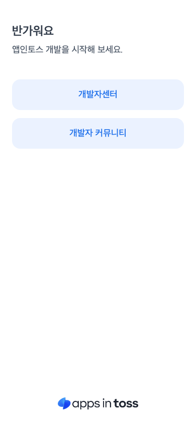
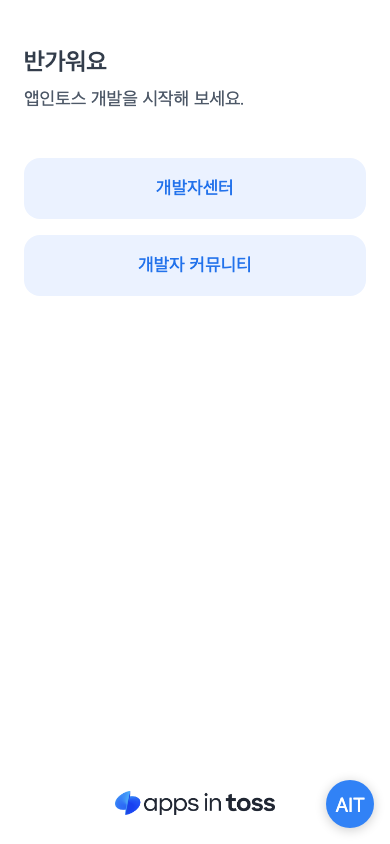
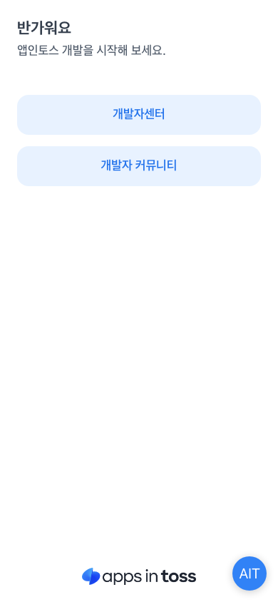

# 프레임워크별 첫 페이지 증적

Vite 9.2.0의 각 프레임워크 엔트리에 Apps in Toss 시작 화면을 적용한 뒤,
`npm run build` 결과의 `/index.html`을 Playwright Chromium(390×844)으로 캡처했어요.

| 프리셋  | JavaScript                | TypeScript                              |
| ------- | ------------------------- | --------------------------------------- |
| Lit     |          |          |
| Preact  |    |    |
| Qwik    |        |        |
| React   |      |      |
| Solid   |      |      |
| Svelte  |    |    |
| Vanilla |  |  |
| Vue     |          |          |

## TDS



재현 명령:

```bash
AIT_RUN_E2E=1 \
AIT_E2E_TEMPLATES=all \
AIT_E2E_SCREENSHOT_DIR=docs/evidence/starter-pages \
yarn test:e2e
```
